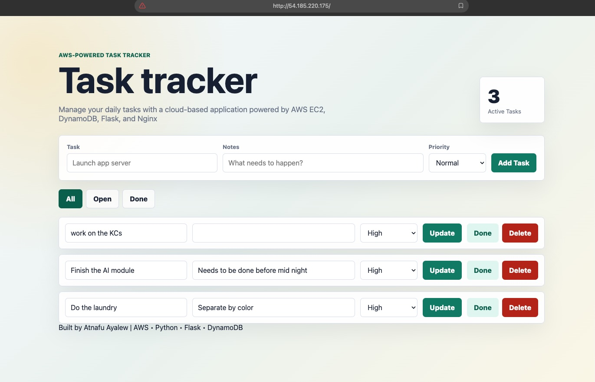
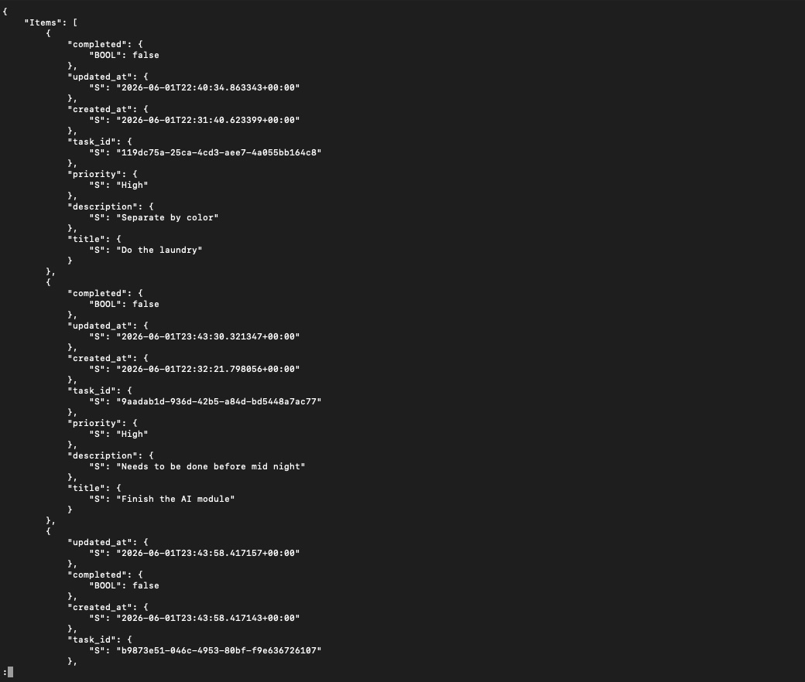

# Task Tracker

A small Flask task tracker designed for EC2 in a default VPC with DynamoDB storage.

## Features

- Add tasks
- Edit task title, notes, and priority
- Mark tasks done or reopen them
- Delete tasks
- Store task data in DynamoDB
## App Screenshot


## Local Run

You need AWS credentials that can access the DynamoDB table.

```bash
python3 -m venv .venv
source .venv/bin/activate
pip install -r requirements.txt
export AWS_REGION=us-east-1
export TASKS_TABLE=AppTrackerTasks
flask --app app run --host 0.0.0.0 --port 8000
```

## Deploy To EC2

First push this project to your GitHub repo, then run the deploy script.

```bash
chmod +x scripts/deploy.sh scripts/destroy.sh
export AWS_REGION=us-east-1
export KEY_NAME=your-existing-ec2-keypair
export GIT_REPO_URL=https://github.com/YOUR_GITHUB_USER/app-tracker.git
./scripts/deploy.sh
```

Optional settings:

```bash
export APP_NAME=app-tracker
export TABLE_NAME=AppTrackerTasks
export INSTANCE_TYPE=t3.micro
export GIT_BRANCH=main
export SSH_CIDR=YOUR_IP/32
export HTTP_CIDR=0.0.0.0/0
```

The script creates or reuses:

- DynamoDB table with `task_id` as the partition key
- IAM role and instance profile for EC2 DynamoDB access
- Security group allowing HTTP and SSH
- Amazon Linux 2023 EC2 instance
- Nginx reverse proxy to Gunicorn
### DynamoDB Table Items



## Cleanup

```bash
./scripts/destroy.sh
```

To also delete the DynamoDB table:

```bash
DELETE_TABLE=true ./scripts/destroy.sh
```
