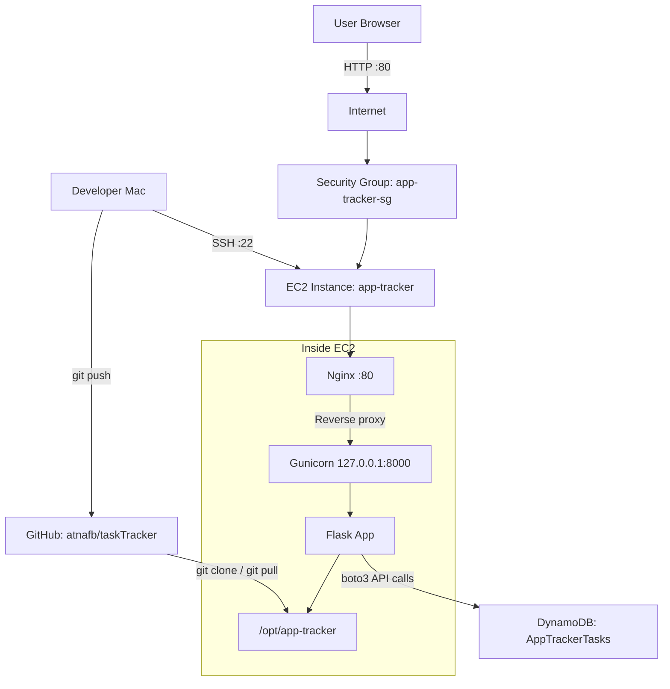

# App Tracker Architecture

## Request Flow

1. The user opens the EC2 public IP in a browser.
2. The security group allows HTTP traffic on port `80`.
3. Nginx receives the request and proxies it to Gunicorn.
4. Gunicorn runs the Flask app.
5. Flask reads and writes task data in DynamoDB using `boto3`.
6. DynamoDB returns task records, and Flask renders the HTML page.

## AWS Resources

| Resource | Name |
| --- | --- |
| EC2 instance | `app-tracker` |
| Security group | `app-tracker-sg` |
| DynamoDB table | `AppTrackerTasks` |
| DynamoDB partition key | `task_id` |
| App directory | `/opt/app-tracker` |
| Public app port | `80` |
| Internal app port | `127.0.0.1:8000` |
